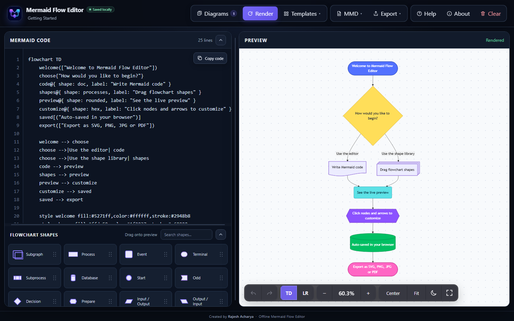
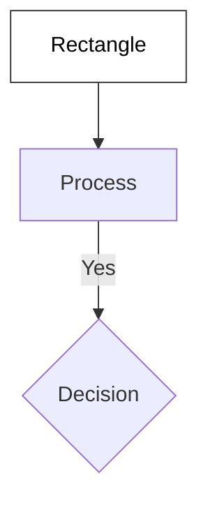

<div align="center">
  
  <h1>Mermaid Flow Editor</h1>
  <p><strong>A private, local-first visual flowchart editor powered by a local Mermaid.js bundle.</strong></p>
  <p>Version 1.0 · Created by <strong>Rajesh Acharya</strong></p>
</div>

<p align="center">
  
</p>

## Overview

Mermaid Flow Editor is a standalone browser application for creating Mermaid flowcharts with code and visual tools side by side. It uses only plain HTML, CSS, and JavaScript—there is no framework, build process, package manager, backend, database, account, analytics service, or CDN.

Everything required to run the editor is stored in this repository. Diagrams, preferences, and recovery snapshots are saved locally in the browser with `localStorage`.

## Quick start

1. Keep the documented folder structure intact.
2. Confirm that the local Mermaid, ELK layout, jsPDF, and svg2pdf bundles exist under `vendor/`.
3. Open `index.html` in a modern browser.
4. Edit Mermaid code, drag a shape into the preview, or load a template.
5. Use **Diagrams** for local projects and recovery history.
6. Use **MMD** for source files or **Export** for rendered output.

No installation, build command, account, or local server is required. The application supports direct `file://` use.

## Version 1.0 highlights

- Line-numbered Mermaid code editing with debounced rendering and line-aware syntax errors
- Visual editing for nodes, node images, links, arrows, subgraphs, colors, multiline labels, borders, and shapes
- Mouse, keyboard, and touch-friendly drag-and-drop workflows
- Multiple locally saved diagrams with automatic version history
- Built-in templates and a searchable Mermaid 11 flowchart shape library
- SVG, PNG, JPG, and vector PDF export with format-specific controls
- Zoom, pan, fit, four flow directions, two layout engines, diagram themes, fullscreen, undo, and redo controls
- Responsive resizable workspace, collapsible editor sections, compact line-number gutters, and a full-width mobile action menu
- Focus-managed dialogs, screen-reader labels, visible focus states, and touch-sized controls
- Fully local Mermaid.js runtime with no required network access

## Contents

- [Quick start](#quick-start)
- [Feature guide](#feature-guide)
- [Keyboard access](#keyboard-access)
- [Project structure](#project-structure)
- [Mermaid.js and offline setup](#mermaidjs-and-offline-setup)
- [Run locally](#run-locally)
- [Deploy to GitHub Pages](#deploy-to-github-pages)
- [Local data and privacy](#local-data-and-privacy)
- [Visual editing scope](#visual-editing-scope)
- [Troubleshooting](#troubleshooting)
- [Technical design](#technical-design)

## Feature guide

### Live code editor

- Mermaid code editor with synchronized line numbers, line count, and a floating **Copy code** action
- Horizontal scrolling preserves Mermaid formatting without forced word wrapping
- The line-number gutter automatically narrows on tablet and mobile screens and grows when the line count gains another digit
- Automatic rendering after typing, with adaptive delays for larger diagrams
- Manual **Render** action for retrying after an error or forcing an immediate refresh
- Syntax errors show the actual editor line and a focused hint where one can be determined
- Automatic fit and center after successful rendering
- Undo and redo history for code and visual edits
- Editable diagram name used for local storage and downloaded filenames

### Visual preview editor

- Click a node to edit its multiline label, bold/italic formatting, hyperlink, shape, image, fill, text color, and border color
- Convert a node to an image node with a relative path, `data:image` URL, or web image URL
- Click an arrow to edit its multiline label, line style, line thickness, start marker, end marker, and color
- Click a subgraph to edit its title, fill, text color, and border color
- Use **Go to code** from a node, arrow, or subgraph editor to expand the code panel and select its source
- Delete nodes, arrows, or subgraphs from their editing panels
- Hover over a node to create a connected shape
- Start an edge from one node or subgraph, then select its destination
- Drag nodes into or out of subgraphs
- Drop one node onto another to create a new subgraph
- Drag subgraphs into other subgraphs to create nested groups
- Automatically remove a subgraph when its final node is moved out
- Pan by dragging empty preview space
- Zoom with controls, an editable percentage, the mouse wheel, or a two-finger pinch
- Fit, fullscreen, and light/dark preview controls
- Top-to-bottom, bottom-to-top, left-to-right, and right-to-left flow directions
- Adaptive (ELK, default) and Hierarchical (Dagre) layout engines
- Coordinated diagram themes that style nodes, subgraphs, and arrows together

### Flowchart shape library

- Searchable library of Mermaid 11 flowchart shapes
- Accurate local SVG thumbnails rendered by Mermaid where supported
- Drag shapes onto the preview with mouse or touch
- Activate a shape with the keyboard or assistive technology to add it to the diagram
- Drop shapes onto nodes or subgraphs to create grouped or connected content
- Includes process, event, terminal, decision, database, document, storage, input/output, horizontal cylinder, subgraph, and many other flowchart shapes
- Responsive card columns adapt when the editor panel is resized

### Templates and onboarding

The **Templates** menu includes ready-to-edit examples for:

- Quick start
- Approval workflow
- System architecture
- Incident response
- Team collaboration
- VPN connectivity between on-premises and Azure data centers

Loading a template saves a recovery snapshot before replacing the current diagram.

### Local diagram library

Open **Diagrams** to:

- Create a diagram
- Open a saved diagram
- Rename a diagram
- Duplicate a diagram
- Delete a diagram
- Review its version history

The editor automatically saves the active diagram and restores it the next time the application is opened in the same browser context.

### Automatic version history

Version history is maintained separately for each diagram.

- Automatic snapshots are throttled to avoid creating one entry per keystroke
- Immediate recovery snapshots are created before imports, templates, clears, and restores
- A manual **Save snapshot now** action is available
- Restoring a version first saves the current working copy as another recovery point
- Duplicate snapshots are skipped
- Up to 20 snapshots are retained per diagram
- Snapshot storage is capped to reduce the risk of exhausting browser storage

Open **Diagrams → History** beside a diagram to review or restore its recovery points.

### Mermaid source files

The **MMD** menu supports:

- **Download .mmd** — save the current Mermaid source using the diagram name
- **Import .mmd** — replace the current diagram with a local Mermaid source file

An import creates a recovery snapshot first. Importing reads a local file; it does not upload it anywhere.

### Export formats

All exports are generated locally in the browser.

| Format | Available controls | Recommended use |
| --- | --- | --- |
| SVG | Export scale, padding, background color, transparent background | Web, editing, and resolution-independent output |
| PNG | Output size, padding, background color, transparent background | Lossless images and documents |
| JPG | Output size, padding, quality, solid background color | Smaller raster files |
| PDF | Padding, background color, page size, orientation | Scalable sharing and printing |

PDF export keeps the diagram as vector content for clean zooming and preserves supported node hyperlinks. It automatically recommends landscape orientation for wide diagrams and portrait orientation for tall or square diagrams. The orientation can still be changed manually.

### Large-diagram behavior

- Adaptive render debounce for longer Mermaid source
- Delegated preview interactions instead of per-render event duplication
- Cached edge and subgraph parsing
- Deferred shape-thumbnail rendering
- Interaction and rendering paths designed for diagrams containing 100 or more nodes

### Responsive and mobile layout

- Desktop uses side-by-side editor and preview panels with draggable dividers
- Tablet portrait stacks the editor above the preview; tablet landscape keeps a compact split view
- Mobile portrait uses a hamburger menu whose three action groups fill the available width
- Code and shape sections can collapse independently to preserve preview space
- Compact landscape mode reduces fully collapsed editor sections to an icon rail
- Touch devices receive larger controls and dedicated drag handles

## Keyboard access

| Action | Shortcut |
| --- | --- |
| Render now | `Ctrl/Cmd + Enter` |
| Fit preview | `F` |
| Open export options | `Ctrl/Cmd + Shift + E` |
| Undo | `Ctrl/Cmd + Z` |
| Redo | `Ctrl/Cmd + Shift + Z` or `Ctrl/Cmd + Y` |
| Delete selected item | `Delete` |
| Delete while editing a label | `Ctrl/Cmd + Delete` |
| Cancel edge creation or close the top dialog | `Esc` |
| Move through an open menu | `Arrow Up`, `Arrow Down`, `Home`, `End` |
| Resize a focused divider | Arrow keys; hold `Shift` for a larger step |
| Activate a focused node, arrow, subgraph, or shape | `Enter` or `Space` |

The application also provides a skip link, focus trapping and return for modal dialogs, accessible names for rendered diagram elements, reduced-motion support, and 44px controls on coarse-pointer devices. This describes implemented accessibility features and is not a formal claim of standards certification.

## Project structure

Keep the following structure intact:

```text
index.html
README.md
.gitignore
assets/
├── css/
│   └── style.css
├── images/
│   ├── editor-preview.png
│   └── logo.png
└── js/
    ├── config.js
    ├── ui.js
    ├── shapes.js
    ├── storage.js
    ├── export.js
    ├── viewport.js
    ├── diagram.js
    └── main.js
vendor/
├── mermaid.min.js
├── mermaid-layout-elk/
│   ├── mermaid-layout-elk.iife.min.js
│   └── LICENSE.txt
├── jspdf.umd.min.js
├── svg2pdf.umd.min.js
├── LICENSE-jspdf.txt
└── LICENSE-svg2pdf.txt
```

JavaScript files are loaded as ordered classic scripts. This keeps the code organized without requiring ES modules, a development server, or a build step.

| Script | Responsibility |
| --- | --- |
| [`assets/js/config.js`](./assets/js/config.js) | Defaults, templates, DOM references, shared state, and constants |
| [`assets/js/ui.js`](./assets/js/ui.js) | Startup, event wiring, menus, dialogs, accessibility, folding, and panel resizing |
| [`assets/js/shapes.js`](./assets/js/shapes.js) | Shape library, search, thumbnails, and mouse/touch drag-and-drop |
| [`assets/js/storage.js`](./assets/js/storage.js) | Rendering, errors, local persistence, diagrams, snapshots, and `.mmd` files |
| [`assets/js/export.js`](./assets/js/export.js) | SVG, PNG, JPG, and PDF export pipelines and options |
| [`assets/js/viewport.js`](./assets/js/viewport.js) | Undo/redo, direction, zoom, pan, fit, themes, and fullscreen |
| [`assets/js/diagram.js`](./assets/js/diagram.js) | Node, arrow, subgraph, nesting, popup, and visual editing interactions |
| [`assets/js/main.js`](./assets/js/main.js) | Final application entry point |

The previous root-level `app.js`, `style.css`, `logo.png`, and `mermaid.min.js` locations are not used by the reorganized application. Keep the paths shown above and in `index.html` unchanged.

## Mermaid.js and offline setup

The application loads all runtime libraries from local vendor files:

```html
<script src="./vendor/mermaid.min.js"></script>
<script src="./vendor/mermaid-layout-elk/mermaid-layout-elk.iife.min.js"></script>
<script src="./vendor/jspdf.umd.min.js"></script>
<script src="./vendor/svg2pdf.umd.min.js"></script>
```

Mermaid renders diagrams, the ELK bundle provides the Adaptive layout, and jsPDF with svg2pdf creates vector PDF exports. The application does not load these libraries from a CDN or require ES modules at runtime.

If `mermaid.min.js` is missing or needs to be replaced:

1. While online, open the [Mermaid package page on npm](https://www.npmjs.com/package/mermaid).
2. Download the package archive.
3. Open the `.tgz` archive with an archive tool.
4. Extract `package/dist/mermaid.min.js`.
5. Place it in the `vendor` folder and keep the filename exactly `mermaid.min.js`.
6. Open `index.html` and confirm that the default diagram renders.

Keep the other vendor files and their license files in the paths shown above. The editor loads every runtime dependency locally afterward.

## Run locally

Open `index.html` directly in Chrome, Edge, Firefox, or another current browser. No command line, installation, or local web server is needed.

Browser behavior can differ for local files:

- Clipboard permissions may be restricted on `file://`; the editor includes a local copy fallback
- Downloads may require browser permission
- Browser storage is associated with the page origin or local-file context
- Private/incognito windows may discard saved data when the window closes

For guaranteed offline access, keep a local copy of the complete project structure.

## Deploy to GitHub Pages

1. Upload `index.html`, `README.md`, `.gitignore`, `assets`, and `vendor` to the root of a GitHub repository.
2. Open **Settings → Pages** in the repository.
3. Under **Build and deployment**, select **Deploy from a branch**.
4. Select the branch containing the application.
5. Select the `/ (root)` folder and save.
6. Open the generated GitHub Pages URL.

All application paths are relative, so no path changes are required for GitHub Pages.

GitHub Pages must be reached online initially. Once files are available locally, the application requires no network access. A web image URL added to a node is loaded only because the user supplied it; use relative paths or `data:image` URLs for offline diagrams. Browser caching alone is not a guaranteed offline installation mechanism, so retain a local project copy when offline availability is essential.

## Local data and privacy

- Diagrams, names, preferences, and version snapshots are stored in browser `localStorage`
- The application has no account system, backend, database, analytics, or tracking
- The application does not automatically upload diagram code or exported files
- A web image URL added to a node can request that image from its remote host; relative paths and `data:image` URLs remain local
- The Help dialog contains an optional link to Mermaid's online syntax documentation; it opens only when selected
- Imported files are read locally by the browser
- Exports and `.mmd` downloads are generated locally

Clearing site data, resetting the browser profile, using private browsing, or moving to another browser can remove or isolate locally saved diagrams. Download important diagrams as `.mmd` files for durable backups.

## Visual editing scope

The code editor can render Mermaid syntax supported by the bundled Mermaid version. Visual editing is intentionally optimized for common flowchart syntax, including:



The visual tools support implicit endpoint nodes, common legacy node declarations, Mermaid's expanded `@{ shape: ... }` syntax, Mermaid image nodes, node hyperlinks, standard flowchart links, styles, subgraphs, nested subgraphs, and connections between nodes and subgraphs. Highly customized Mermaid expressions may render correctly but require direct code editing rather than visual manipulation.

## Troubleshooting

### Mermaid could not be loaded

- Confirm that `vendor/mermaid.min.js` exists
- Confirm the filename and letter casing are exact
- Re-download the browser bundle if the file is incomplete

### Adaptive layout or vector PDF export is unavailable

- Confirm that `vendor/mermaid-layout-elk/mermaid-layout-elk.iife.min.js` exists for Adaptive layout
- Confirm that `vendor/jspdf.umd.min.js` and `vendor/svg2pdf.umd.min.js` exist for vector PDF export
- Keep the vendor paths unchanged because `index.html` loads them directly

### The preview shows a syntax error

- Read the reported editor line and pointer shown above the preview
- Follow the focused hint when the editor recognizes an incomplete construct such as a missing `end`
- Check the most recently edited line if no specific hint is available
- Load a built-in template to compare valid syntax
- Use **Diagrams → History** if an accidental edit replaced working code

### Copy code does not work

- Allow clipboard access if the browser requests it
- Try selecting and copying directly from the code editor
- A hosted HTTPS version generally receives broader clipboard support than `file://`

### Saved diagrams disappeared

- Confirm that the same browser and browser profile are being used
- Avoid private/incognito mode for persistent work
- Check whether site data was cleared
- Use downloaded `.mmd` files as long-term backups

### A download does not start

- Allow downloads for the page
- Check the browser's download tray or popup blocker
- Try a smaller export scale for very large diagrams

### GitHub Pages works online but not offline

GitHub Pages is hosting, not a guaranteed offline installer. Keep a local copy of the complete project and open `index.html` directly when reliable offline access is required.

## Technical design

- Plain HTML5, CSS, and vanilla JavaScript
- Local Mermaid.js, ELK layout, jsPDF, and svg2pdf browser bundles
- Strict Mermaid security level
- Browser `localStorage` persistence
- Browser File, Blob, Canvas, SVG, and Fullscreen APIs
- No `eval`
- No React, Vite, Node.js runtime, npm runtime, framework, CDN, service worker, backend, or database

## Author

Created by **Rajesh Acharya**.

Mermaid Flow Editor is an independent editor that uses the open-source Mermaid rendering library. Mermaid is a separate project with its own documentation and licensing.
